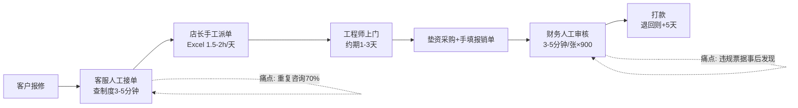
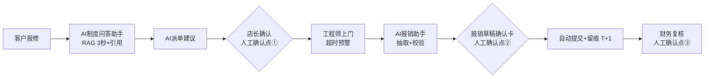

# 流程图说明（含 Mermaid 源码）

本目录两张 PNG 由项目组按 6 人访谈与典型事件（GD-20261103-087）绘制；Mermaid 源码如下，可在 GitHub 直接渲染。

## 改造前

```mermaid
flowchart LR
  A[客户报修] --> B[客服人工接单<br/>查制度3-5分钟]
  B --> C[店长手工派单<br/>Excel 1.5-2h/天]
  C --> D[工程师上门<br/>约期1-3天]
  D --> E[垫资采购+手填报销单]
  E --> F[财务人工审核<br/>3-5分钟/张×900]
  F --> G[打款<br/>退回则+5天]
  B -.痛点: 重复咨询70%.-> B
  F -.痛点: 违规票据事后发现.-> F
```

## 改造后

```mermaid
flowchart LR
  A[客户报修] --> B[AI制度问答助手<br/>RAG 3秒+引用]
  B --> C[AI派单建议]
  C --> D{店长确认<br/>人工确认点①}
  D --> E[工程师上门<br/>超时预警]
  E --> F[AI报销助手<br/>抽取+校验]
  F --> G{报销草稿确认卡<br/>人工确认点②}
  G --> H[自动提交+留痕 T+1]
  H --> I[财务复核<br/>人工确认点③]
```
